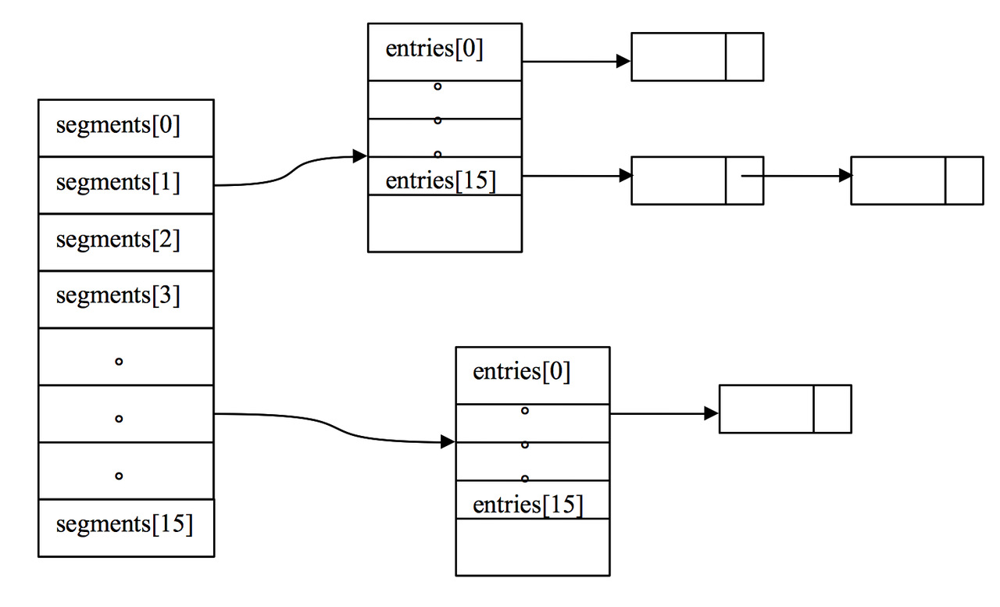
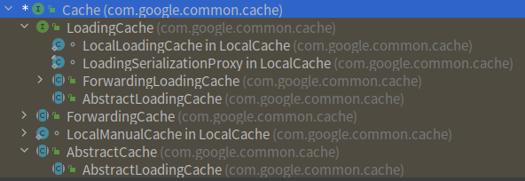

# Guava LocalCache源码分析
## 简介

> 基于guava-31.1-jre

本地缓存是非常常用的工具，平常我们常用的库有ConcurrentHashMap、手撸LRUCache和Caffeine、安卓有LRU cache。
当然还有Guava Cache。Guava Cache是一款常用的本地缓存库，除了缓存数据，额外提供了一些功能。比如
- LRU移除数据
- 过期机制
- 移除数据监听
- 缓存数据（缓存数、命中率、异常数等）监控
- 异步刷新机制
- 等等。

## 常见用法

### 基础接口Cache用法

使用这个接口的实现去build和管理cache，一般用户自己拉数据来源并塞到cache。
- Get callable
- getIfPresent
- getAllPresent
- put
- invalidate

~~~~java

Cache<CacheKey, CacheValue<InMemoryItem>> cache = CacheBuilder
.newBuilder()
.maximumSize(10)
.expireAfterWrite(60, TimeUnit.SECONDS)
.build();

CacheKey cacheKey = new CacheKey("key", "field");
CacheValue<InMemoryItem> item = cache.get(cacheKey, () -> LoadingCacheLoader.loadOne(cacheKey));
System.out.println("item:" + item);

CacheKey cacheKey2 = new CacheKey("key2", "field2");
CacheValue<InMemoryItem> item2 = cache.getIfPresent(cacheKey2);
System.out.println("item:" + item2);

System.out.println("items" + cache.getAllPresent(Lists.newArrayList(cacheKey, cacheKey2)));

~~~~

### LoadingCache用法
Cache下的一个接口，这种方式一般提供一个自实现Loader给builder，通过Loader去管理加载行为。
- get
- getAll
- invalidate

~~~~
  LoadingCache<CacheKey, CacheValue<InMemoryItem>> cache = CacheBuilder
  .newBuilder()
  .maximumSize(10)
  .expireAfterWrite(60, TimeUnit.SECONDS)
  .build(new CacheLoader<CacheKey, CacheValue<InMemoryItem>>() {
  @Override
  public CacheValue<InMemoryItem> load(CacheKey key) throws Exception {
  String id = String.valueOf(ThreadLocalRandom.current().nextInt(100));
  return new CacheValue<>(new InMemoryItem(id, null), 1L);;
  }
  });


CacheKey cacheKey = new CacheKey("key", "field");
CacheValue<InMemoryItem> item = cache.get(cacheKey, () -> LoadingCacheLoader.loadOne(cacheKey));
System.out.println("item:" + item);

CacheKey cacheKey2 = new CacheKey("key2", "field2");
CacheValue<InMemoryItem> item2 = cache.get(cacheKey2);
System.out.println("item:" + item2);

System.out.println("items" + cache.getAll(Lists.newArrayList(cacheKey, cacheKey2)));

cache.invalidate(cacheKey);
~~~~

## 源码分析

### 数据结构
Guava Cache的存储结构可以简单理解等同为ConcurrentHashMap（JDK1.6）。



如图，整个LocalCache实现可以理解segment数组，元素是hash表（数组），hash数组的元素通过链表连接。

### 代码继承



为什么前面说Guava Cache可以理解为是`ConcurrentHashMap`呢？
其实Guava Cache的封装和野心不小，Cache接口和LoadingCache只是一个抽象接口和标准，内部很多实现通过**装饰类**来做。  
而他们的本地缓存实现是`LocalLoadingCache`和`LocalManualCache`，核心是高度派生于`ConcurrentHashMap`的`LocalCache`实现。

**核心类：com.google.common.cache.LocalCache** 
>The concurrent hash map implementation built by CacheBuilder.
>This implementation is heavily derived from revision 1.96 of ConcurrentHashMap.java .

核心存储处理类LocalCache的实现和文档说明一样，是高度仿制ConcurrentHashMap（JDK1.6）。接下来我分析下它的初始化和执行。

### 初始化
初始化做逐行注释。
````java
LocalCache(
CacheBuilder<? super K, ? super V> builder, @Nullable CacheLoader<? super K, V> loader) {
concurrencyLevel = Math.min(builder.getConcurrencyLevel(), MAX_SEGMENTS); // 并法度，设置segment会用到

    keyStrength = builder.getKeyStrength(); //key的强度，普通对象、soft
    valueStrength = builder.getValueStrength(); //value的强度, 普通对象、soft、weak

    keyEquivalence = builder.getKeyEquivalence(); // 如何对比key相等的策略，包括hash方式和equal方式
    valueEquivalence = builder.getValueEquivalence(); //如何对比value相等的策略

    maxWeight = builder.getMaximumWeight(); //最大weight，localCache有两种模式，当设置了最大权重每设置最大CacheSize用最大权重去衡量最大缓存size，其他情况用最大缓存size
    weigher = builder.getWeigher(); // weighter权重器，一般不怎么使用，举个例子，我们在缓存里有某些热点cache是热点大空间value，可以用这个来调权去影响过期策略
    expireAfterAccessNanos = builder.getExpireAfterAccessNanos(); //最后访问后过期时间
    expireAfterWriteNanos = builder.getExpireAfterWriteNanos(); //最后写后的过期时间
    refreshNanos = builder.getRefreshNanos(); // 刷新时间
        
    removalListener = builder.getRemovalListener(); //移除item的消息监听器
    //移除item的消息监听器的排队通知队列
    removalNotificationQueue =
        (removalListener == NullListener.INSTANCE)
            ? LocalCache.<RemovalNotification<K, V>>discardingQueue()
            : new ConcurrentLinkedQueue<RemovalNotification<K, V>>();
    //一个获取时间的简单封装
    ticker = builder.getTicker(recordsTime());
    //一个new Entry的工厂类，具体可看EntryFactory
    entryFactory = EntryFactory.getFactory(keyStrength, usesAccessEntries(), usesWriteEntries());
    globalStatsCounter = builder.getStatsCounterSupplier().get();
    defaultLoader = loader;
    //初始化容量大小，非自定义weight 则取最小
    int initialCapacity = Math.min(builder.getInitialCapacity(), MAXIMUM_CAPACITY);
    if (evictsBySize() && !customWeigher()) {
      initialCapacity = (int) Math.min(initialCapacity, maxWeight);
    }

    // Find the lowest power-of-two segmentCount that exceeds concurrencyLevel, unless
    // maximumSize/Weight is specified in which case ensure that each segment gets at least 10
    // entries. The special casing for size-based eviction is only necessary because that eviction
    // happens per segment instead of globally, so too many segments compared to the maximum size
    // will result in random eviction behavior.
    int segmentShift = 0;
    int segmentCount = 1;
    // 设置sement数，大于等于并法度的最小2幂次方或者segment数*20已经接近最大缓存值
    while (segmentCount < concurrencyLevel && (!evictsBySize() || segmentCount * 20 <= maxWeight)) {
      ++segmentShift;
      segmentCount <<= 1;
    }
    //算选segment的时候，帮助移位打散，极大减少同entry、同bucket元素
    this.segmentShift = 32 - segmentShift;
    //选segment用到，预先计算好，方便选segment
    segmentMask = segmentCount - 1;
    //初始化segment
    this.segments = newSegmentArray(segmentCount);

    int segmentCapacity = initialCapacity / segmentCount;
    if (segmentCapacity * segmentCount < initialCapacity) {
      ++segmentCapacity;
    }

    int segmentSize = 1;
    while (segmentSize < segmentCapacity) {
      segmentSize <<= 1;
    }
    //初始化entry
    if (evictsBySize()) {
      // Ensure sum of segment max weights = overall max weights
      long maxSegmentWeight = maxWeight / segmentCount + 1;
      long remainder = maxWeight % segmentCount;
      for (int i = 0; i < this.segments.length; ++i) {
        if (i == remainder) {
          maxSegmentWeight--;
        }
        this.segments[i] =
            createSegment(segmentSize, maxSegmentWeight, builder.getStatsCounterSupplier().get());
      }
    } else {
      for (int i = 0; i < this.segments.length; ++i) {
        this.segments[i] =
            createSegment(segmentSize, UNSET_INT, builder.getStatsCounterSupplier().get());
      }
    }
}
````

### 执行

#### get方法核心逻辑

核心执行栈如下：
>loadFuture:3533, LocalCache$LoadingValueReference (com.google.common.cache)  
>**loadSync:2282, LocalCache$Segment (com.google.common.cache)**  
>**lockedGetOrLoad:2159, LocalCache$Segment (com.google.common.cache)**  
>**get:2049, LocalCache$Segment (com.google.common.cache)**  
>**get:3966, LocalCache (com.google.common.cache)**  
>getOrLoad:3989, LocalCache (com.google.common.cache)  
>get:4950, LocalCache$LocalLoadingCache (com.google.common.cache)  

我重点标注下需要关注看的源码：

LocalCache.get(K key, CacheLoader<? super K, V> loader)方法
````
return segmentFor(hash).get(key, hash, loader); // 计算key所在的segment
````

LocalCache$segment方法
````
// 
V get(K key, int hash, CacheLoader<? super K, V> loader) {
// 前面代码省略
// 这里关注下，可考虑重写loader的refresh方法，结合refresh时间能够异步刷新cache
return scheduleRefresh(e, key, hash, value, now, loader);
// at this point e is either null or expired;
//同步加锁和load cache
return lockedGetOrLoad(key, hash, loader);
````

LocalCache$segment的lockedGetOrLoad方法
````
    ReferenceEntry<K, V> e;
      ValueReference<K, V> valueReference = null;
      LoadingValueReference<K, V> loadingValueReference = null;
      boolean createNewEntry = true;
      //锁
      lock();
      try {
        // re-read ticker once inside the lock
        long now = map.ticker.read();
        preWriteCleanup(now);

        int newCount = this.count - 1;
        //获取当前segment下的hash表
        AtomicReferenceArray<ReferenceEntry<K, V>> table = this.table;
        int index = hash & (table.length() - 1); //初始化时table大小为2的幂次方的原因
        ReferenceEntry<K, V> first = table.get(index);
        
        for (e = first; e != null; e = e.getNext()) {
          K entryKey = e.getKey();
          if (e.getHash() == hash
              && entryKey != null
              //通过equal比对器比对是否真正的键值
              && map.keyEquivalence.equivalent(key, entryKey)) {
            valueReference = e.getValueReference();
            //加载中，不新增
            if (valueReference.isLoading()) {
              createNewEntry = false;
            } else {
              V value = valueReference.get();
              if (value == null) {
              //value被gc了
                enqueueNotification(
                    entryKey, hash, value, valueReference.getWeight(), RemovalCause.COLLECTED);
              } else if (map.isExpired(e, now)) {
                // This is a duplicate check, as preWriteCleanup already purged expired
                // entries, but let's accommodate an incorrect expiration queue.
                //过期了
                enqueueNotification(
                    entryKey, hash, value, valueReference.getWeight(), RemovalCause.EXPIRED);
              } else {
              // 有值，返回
                recordLockedRead(e, now);
                statsCounter.recordHits(1);
                // we were concurrent with loading; don't consider refresh
                return value;
              }

              // immediately reuse invalid entries
              writeQueue.remove(e);
              accessQueue.remove(e);
              this.count = newCount; // write-volatile
            }
            break;
          }
        }

        if (createNewEntry) {
          loadingValueReference = new LoadingValueReference<>();

          if (e == null) {
            e = newEntry(key, hash, first);
            e.setValueReference(loadingValueReference);
            table.set(index, e);
          } else {
            e.setValueReference(loadingValueReference);
          }
        }
      } finally {
        unlock();
        postWriteCleanup();
      }

      if (createNewEntry) {
        try {
          // Synchronizes on the entry to allow failing fast when a recursive load is
          // detected. This may be circumvented when an entry is copied, but will fail fast most
          // of the time.
          synchronized (e) {
          //同步加载值
            return loadSync(key, hash, loadingValueReference, loader);
          }
        } finally {
          statsCounter.recordMisses(1);
        }
      } else {
        // The entry already exists. Wait for loading.
        return waitForLoadingValue(e, key, valueReference);
      }
````

#### 缓存驱逐机制
- EXPLICIT 手动invalidate
- REPLACED put替代
- COLLECTED gc回收
- EXPIRED 过期
- SIZE 超过size限制

## 总结

Guava Local Cache的存储结构可以简单理解为JDK1.6的ConcurrentHashMap，同时它比ConcurrentHashMap 拓展出了很多实用功能，比如监控、高性能加载、缓存回收机制、权重加载、控制缓存数等。

## Reference
[1]Guava Cache包源码  
[2][Guava Cache wiki|github](https://github.com/google/guava/wiki/CachesExplained)


