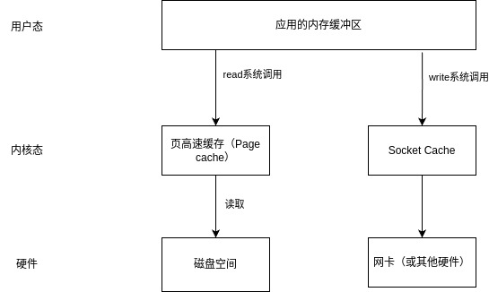
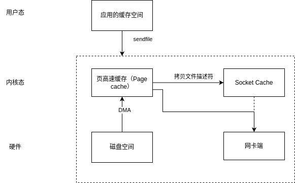
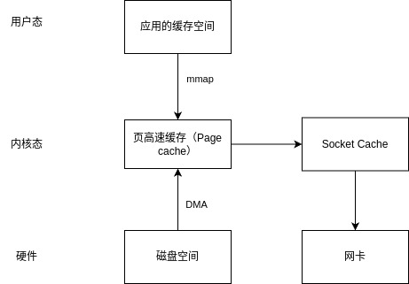

# Java零拷贝

## 简介

零拷贝（zero-copy）是一种内存优化技术，目标是减少内存复制和上下文切换，该机制能够大幅度提高IO操作效率。
比如RocketMQ里面的文件读写持久化可以看到其身影。

## 普通IO

传统普通IO传输数据通常需要4次上下文切换和4次数据拷贝。

java的普通io可以用io包里的reader/writer，
下面是FileReader和FileWriter例子：
~~~~java
        String sourceFile = "test.json";
        String targetFile = "test_copy.json";

        try (FileReader reader = new FileReader(sourceFile);
            FileWriter writer = new FileWriter(targetFile)) {

            char[] chars = new char[1024];
            int count;
            while ((count = reader.read(chars)) != -1) {
                writer.write(chars, 0, count);
            }

            System.out.println("read write file done！");

        } catch (IOException e) {
            e.printStackTrace();
        }
~~~~

## Java零拷贝

### sendfile

Linux 在版本2.1中引入了 sendfile() 这个系统调用，sendfile()是一种零拷贝的实现。  
通过sendfile和DMA做到了：
* 数据没有CPU copy（大优化）
* 四次上下文切换降为两次上下文切换

缺点是：无法修改文件数据。

Java的实现是`FileChannel.transferTo/transferFrom`。下面是一个文件传输的例子。
~~~~java
        String sourceFile = "test.json";
        String targetFile = "test_copy.json";
        try (FileInputStream fis = new FileInputStream(sourceFile);
            FileOutputStream fos = new FileOutputStream(targetFile);
            FileChannel inChannel = fis.getChannel();
            FileChannel outChannel = fos.getChannel()) {
            // 零拷贝传输
            inChannel.transferTo(0, inChannel.size(), outChannel);
        } catch (IOException e) {
            throw new RuntimeException(e);
        }
~~~~

### mmap实现

mmap（Memory Mapped Files）是一种零拷贝技术。mmap将文件映射到进程的内存地址空间，实际加载到PageCache由系统完成。那么进程操作是对pageCache做操作。

从经验来看，mmap 在内存充足、数据文件较小且相对固定的场景下，性能比 FileChannel 高。  
优点是：
* 减少了CPU copy和上下文切换
* 能够改文件数据

缺点是：
* 使用时必须指定好内存映射大小，且大小有限。
* 从上面的描述可以看出，刷盘时间是不可控的。  

mmap的写入也是先把数据写入到 PageCache，不是直接把数据写到硬盘中。它的底层借助了内存来加速，即 MappedByteBuffer 的 put 实际是对内存进行操作。具体刷盘依赖操作系统定时刷盘或者手动调用 mappedByteBuffer.force() 刷盘。

~~~~java
    String sourceFile = "/home/teaho/IdeaProjects/bookspace/java-api-learning/javacode/jdk/src/test/resources/test.json";
    try (FileChannel fileChannel = new RandomAccessFile(new File(sourceFile), "rw").getChannel();) {
        MappedByteBuffer mappedByteBuffer = fileChannel.map(FileChannel.MapMode.READ_WRITE, 0, fileChannel.size());

        byte[] data = "test".getBytes(StandardCharsets.UTF_8);
        int position = 0;
        ByteBuffer subBuffer = mappedByteBuffer.slice();
        subBuffer.position(position);
        subBuffer.put(data);

    } catch (IOException e) {
        throw new RuntimeException(e);
    }
~~~~

## 总结

零拷贝是一个内存优化技术，能够帮助我们压榨性能。  
合理的使用Java里实现的sendfile和mmap技术，能够优化文件读写和传输。
它们的优点主要是：
1. 减少了CPU copy，从4次减少到1次或0次。
2. 减少了上下文切换
3. 降低了内存占用

所以看到他们的身影出现在一些中间件的文件传输和高吞吐网络传输场景里。  
比如，**RocketMQ**的DefaultMappedFile类(我看的是5.1.3版本)就是通过mmap去读文件数据或者刷盘。  
Kafka则是使用了**sendfile**给consumer传数据。

