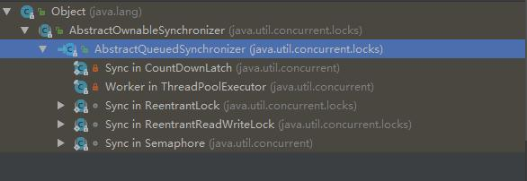

# java.util.concurrent.locks.AbstractQueuedSynchronizer

## 简介

提供给阻塞锁和基于FIFO等待序列的相关同步器实现的一个框架。此类设计给那些依靠一个int来表示状态的同步器。子类必须定义方法去改变状态，
比如，acquired和released。然，由于要确保同步，子类需使用 `getState`, `setState` and `compareAndSetState`方法获取或更新状态。

子类最好被定义为非公共(non-public)内部(internal)工具类，供其封闭类（enclosing类，不懂译得对否，即相对来说前者是嵌套类，Nested class）。

此锁类支持排他模式和共享模式。在排他模式中，其他线程将不能成功获取到此锁。通常，子类实现仅支持其中一种模式，但例如，ReadWriteLock
是可以同时使用两种模式。

该类还定义了一个嵌套的 AbstractQueuedSynchronizer.ConditionObject类，它能给那些是排他实现的子类提供支持。

序列化该类仅存了原子int状态值，所以反序列化后的类会使空线程队列。

要使用该类作为同步器的基本机构，需重新定义如下方法去检测和修改同步int状态：

* tryAcquire
* tryRelease
* tryAcquireShared
* tryReleaseShared
* isHeldExclusively

这些方法的实现必须是线程安全的，且应是短的非阻塞的。实现这些方法是使用该类的真正目的。

AQS的继承结构：

可看到，比如ThreadPoolExecutor，ReentrantLock,CountDownLaunch,Semaphore等Concurrent包下的核心类都在内部实现了此类，
还有一些比如CyclicBarrier是使用了ReentrantLock。由此可见，AQS的价值。

## 源码阅读

## references

