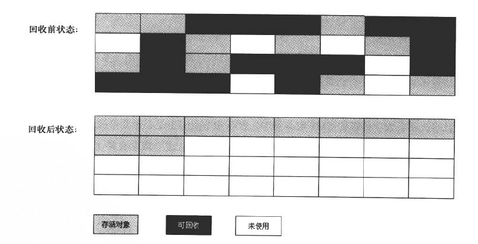
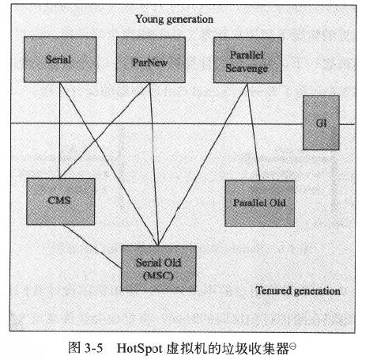

# 垃圾回收

**注**：本篇笔记主要是学习[深入理解Java虚拟机[1]](#references)第三章的简单总结。GC不是本gitbook的关注点，故本篇仅简单描述以帮助其他地方说明，不作一些延伸探究。

## 定义

垃圾回收(Garbage Collection, 下统称GC)是Java语言的一个特点。GC让java避免了想C/C++那样需要手动释放内存。

### 哪些内存需要GC

关于Java运行时内存区域的划分，可看[JVM的运行时内存结构](java-memory-structure.html)。

其中程序计数器(pc Register)、虚拟机栈(JVM stack)、本地方法栈(Native Method Stack)这3个区域随线程而生，随线程而灭；
且每个栈帧分配多少内存大体上可认为是编译期可确定的。

而Java堆和方法区却不一样，直到运行时才会知道创建了多少对象及哪些对象，且每个对象的大小也可能动态变化等等，所以，垃圾收集器（GC）关注的就是这两部分的内存。

## GC的分类

> 针对HotSpot VM的实现，它里面的GC其实准确分类只有两大种：
>* Partial GC：并不收集整个GC堆的模式
>    * Young GC：只收集young gen的GC
>    * Old GC：只收集old gen的GC。只有CMS的concurrent collection是这个模式
>    *Mixed GC：收集整个young gen以及部分old gen的GC。只有G1有这个模式
>* Full GC：收集整个堆，包括young gen、old gen、perm gen（如果存在的话）等所有部分的模式。

摘自 [ 知乎 | RednaxelaFX | Major GC和Full GC的区别是什么？触发条件呢？ ](https://www.zhihu.com/question/41922036/answer/93079526)

注意：Young GC等同于书中所说的Minor GC。

## GC的触发条件

[ 知乎 | RednaxelaFX | Major GC和Full GC的区别是什么？触发条件呢？ ](https://www.zhihu.com/question/41922036/answer/93079526)

[ 知乎 | Ted Mosby | Major GC和Full GC的区别是什么？触发条件呢？ ](https://www.zhihu.com/question/41922036/answer/144566789)

## 判断对象是否生存

也可理解为标记可回收对象。

### 引用计数算法

算法是这样的：给对象一个引用计数器，存在一个引用加1，引用失效，减一。

优点是，实现简单，判断高效。

缺点是，很难解决对象间相互循环引用的问题。

### 可达性分析算法

在主流的商用语言的驻留实现中，都是通过该算法来判定对象是否存活。

通过一系列称作”GC Roots“的对象作为起点，从这些节点开始不断向下搜索引用，形成引用链，得出的结果后用图来判断就是，当从一个对象从GC Roots出发是不可达的，那么这个对象是不可用的。

### 引用

引用分为4种：

* 强引用 普遍存在，类似`Object obj = new Ojbect()`这类引用。

* 软引用 SoftReference 用于描述有用但不是必须的对象。在系统将要发生内存溢出前，将会把这对象列进回收范围之中进行回收。

* 弱引用 WeakReference 用来描述非必需对象。被弱引用关联的对象只能生存到下一次垃圾收集发生之前。

* 虚引用（幽灵引用）PhantomReference 是最弱的引用关系。
一个对象是否有虚引用的存在，完全不会对其生存时间构成影响，也无法通过幽灵引用来取得一个对象实例。
为一个对象设置虚引用关联的唯一目的就是能在这个对象被收集器回收时收到一个系统通知。

会在写引用时再作详细描述。

### 生存还是死亡

要真正宣告一个对象死亡，至少要经历两次标记过程：若果一个对象在可达性分析后得出的结果是，GC Root到该对象是不可达的，
那么该对象将被第一次标记，并进行性一次筛选。筛选的条件是，此对象是否有必要执行finalize方法（当对象没覆盖finalize方法或finalize方法已经被虚拟机调用过），如果有必要则会放入F-Queue中待Finalize线程启动。
之后，假如该对象执行finalize方法时成功将自己“拯救”（即，使GC ROOTs到该对象是可达的），
那么在第二次标记时，该对象将被移出待回收集合。

### 回收方法区

主要会回收两个部分：

1. 废弃常量

    以字符串池为例，当存在”abc“在池中，假如当前系统任何一个String对象引用了”abc“也没有地方引用这个字面量。则”abc“在GC时会被回收。

2. 无用的类

    如何判断一个类无用：

    * 该类所有实例都已经被回收
    * 加载该类的ClassLoader废弃（被回收）
    * 该类的Class对象没有在任何地方被引用

## 垃圾回收算法

### 标记-清除算法

分标记和清除两步。标记上一节已作出描述，清除就是将标记的对象直接清除。

有两点不足之处：

1. 效率，标记和清除两个过程的效率都不高。

2. 空间问题。清除后的内存空间会产生大量碎片，当新建对象时无法找到足够的连续内存会触发另一次垃圾回收。

### 复制算法

现代的商用虚拟机都采用这种方法来收集**新生代**。

具体就是将新生代划分为一个较大的Eden区，和两块较小的Survivor区。具体运行时数据区域划分看[JVM的运行时数据区域](jvm-memory-struture.html)。
每次使用Eden和一个Survivor区，在回收时会将这两者存活对象复制到另一个空的Survivor中。

Hotspot虚拟机默认Eden和Survivor比例是8:1，8+1+1=新生代。

### 标记-整理算法

直接取书中的图比较直观：

## HotSpot的算法实现

### 枚举根节点

在上面[可达性分析算法](#可达性分析算法)中提到了GC Roots，那么该节会说下如何枚举GC Roots节点。

可作为GC Roots的对象种类：
* 虚拟机栈（帧栈中的本地变量表）中引用的对象。
* 方法区中类静态属性引用的对象。
* 方法区常量引用的对象。
* 本地方法栈中JNI引用的对象。

由于以下原因，枚举根节点必须以一个高效的方式进行：
1. 空间问题，现在的程序占用内存一般都n个G起跳。我们不能够逐一判断每个引用对象是否能成为GC Roots。

2. 由于要保证GC前后整个程序的**一致性**，所以GC进行时必须停止一切执行线程（Stop the world）。在某些垃圾收集器中，可能并不是所有GC步骤都stop the world，
但枚举根节点这一步必须是stop the world。

由于目前的主流Java虚拟机使用的是准确式GC，JVM是有办法直接得知存放对象引用的地方。HotSpot VM使用OopMap作记录实现的。
在类加载完成的时候，HotSpot VM就把对象内什么偏移量对应什么类型数据计算出来了。JIT也会作类似操作。

### 安全点

HotSpot VM仅在特定的位置记录信息生成OopMap，这些位置成为安全点。当程序在执行时，只有到达了安全点才会暂定并开始GC。

### 安全区域

安全区域就是扩展了的安全点。

## 垃圾收集器

结合书上的下图简单说下（下图说明了各垃圾收集器可应用的generation）：

* serial收集器

    单线程。

* parnew收集器

    相当于多线程的serial收集器，注意应应用在多核处理器环境。

* parallel scavenge收集器

    多线程，和其他收集器有一个比较大的区别是：该收集器着重关注吞吐量（即，程序非gc运行时间占总程序运行时间）。有一些参数可供设置，请参考书或网上资料。

* serial old收集器

    单线程用于年老代的收集器。

* parallel old收集器

    多线程的serial old。

* CMS收集器

    注重于用户响应，该收集器的关注点是尽量缩小gc时间，适合服务器(server)使用。但缺点很多，个人认为现在g1也是比较成熟，选该收集器前应先考虑g1收集器。

* g1收集器

    g1不是一个分代结构的收集器，同时，它是适合服务器使用的收集器。g1收集器是将堆视为一个个等大的区域，然后根据自身算法，对一些优先级高的区域进行收集。

以上的收集器有不少参数还有关于如何阅读gc日志，请参考书本。回收日志还可以使用一些工具帮助分析，[GCViewer](https://github.com/chewiebug/GCViewer)、[gchisto](https://github.com/jewes/gchisto)。

PS.最后一点供参考，我的机器是Java8 多核，默认使用parallel scavenge+parallel old。
我之前在oracle的一篇blog上看到（忘记具体出处了），g1将会是Java9 默认收集器。

## 内存分配和回收策略

这节仅说了一些普遍规则。实际上，由于各收集器的差异性和堆各部分参数的设置等等，当我们需要验证一些规则，比如，年轻代的对象什么时候进入老年代等等，
最合适的方式是，自己写代码设参数，结合文档、输出和工具，去验证。

* 对象优先在eden区分配

* 大对象直接进入老年代

    -XX:PretenureSizeThreshold参数可使大于该设置值的对象直接进入老年代。

    注意一点，写程序应尽量避免创造出一堆短命的大对象。这个问题我也遇到过，曾导致GC的频率过多，严重影响了程序运行吞吐。

* 长期存活的对象将进入老年代

    默认15岁进入老年代，当然，有参数`-XX:MaxTenuringThreshold=threshold`可设置进入老年代的年龄。
    该文章的图比较形象的体现了对象在年轻代与老年代的运转。[ImportNew | Minor GC、Major GC和Full GC之间的区别][link: 2]

* 动态对象年龄判定

    如果在Survivor区中相同年龄所有对象大小总和大于Survivor空间的一半，年龄大于或等于该年龄的对象就可以直接进入老年代。

* 空间分配担保

    年老代的连续空间大于新生代总大小或历次晋升的平均大小就会进行Minor GC，否则将进行Full GC。

    在JDK 6 Update 24之前规则有所不同，请参考书。

## references

[1]周志明.深入理解Java虚拟机:JVM高级特性与最佳实践,第2版.中国:机械工业出版社,2013

[2] [ImportNew | Minor GC、Major GC和Full GC之间的区别][link: 2]

[link: 2]: http://www.importnew.com/15820.html

