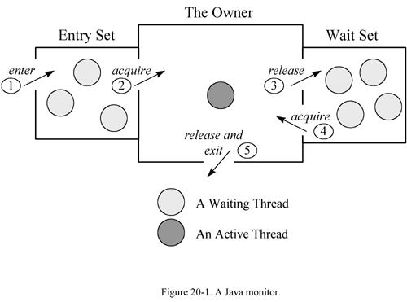

# monitor

Java所使用的主要的阻塞同步机制是监视器(monitor)。

这篇文章[Inside the Java Virtual Machine | Chapter 20 Thread Synchronization][link: 1]
十分详细地解释了monitor。

Monitor是 Java中用以实现线程之间的互斥与协作的主要手段。
每一个对象有且仅有一个monitor。

一次只有一个线程可占有一个对象的监视器。（摘自JavaDoc`Object.notify()`：Only one thread at a time can own an object's monitor.）。

下图是monitor的抽象图(摘自上面链接的文章)：

* 进入区(Entry Set):表示线程通过synchronized要求获取对象的锁。如果对象未被锁住,则进入拥有者;否则则在进入区等待。一旦对象锁被其他线程释放,立即参与竞争。
* 拥有者(The Owner):表示某一线程成功竞争到对象锁。
* 等待区(Wait Set):表示线程通过对象的wait方法,释放对象的锁,并在等待区等待被唤醒。

从图中可以看出，一个 Monitor在某个时刻，只能被一个线程拥有，该线程就是 “Active Thread”，而其它线程都是 “Waiting Thread”，分别在两个队列 “ Entry Set”和 “Wait Set”里面等候。
在 “Entry Set”中等待的线程状态是 “Waiting for monitor entry”，而在 “Wait Set”中等待的线程状态是 “in Object.wait()”。
我们称被 synchronized保护起来的代码段为临界区。当一个线程申请进入临界区时，它就进入了 “Entry Set”队列。

## monitor相关指令

恩，以上说的可能有点抽象，我们可以想办法近距离观察下monitor的存在。

这是一个含有`synchronized`块的代码：
[include:7-](../../javacode/src/main/java/com/tea/lang/monitor/Monitor.java)

[include:1-](Monitor.class.txt)
关注下这两行
~~~
4: monitorenter //进入Monitor.class相关联的那个monitor
//……省略几行
9: monitorexit //退出Monitor.class相关联的那个monitor
~~~

如下是JVM规范里两个指令的描述（放出来仅供其他问题的参考，对于帮助理解monitor的概念，作用不大）。

[JVM Specification | 6.5.monitorenter](http://docs.oracle.com/javase/specs/jvms/se8/html/jvms-6.html#jvms-6.5.monitorenter)

[JVM Specification | 6.5.monitorexit](http://docs.oracle.com/javase/specs/jvms/se8/html/jvms-6.html#jvms-6.5.monitorexit)

so，由上，可稍微感受到monitor的存在。

## references

[1][Inside the Java Virtual Machine | Chapter 20 Thread Synchronization][link: 1]

[2][JavaStuff.in | synchronization](http://www.javastuff.in/2011/08/synchronization.html)

[3][探索 Java 同步机制——Monitor Object 并发模式在 Java 同步机制中的实现](https://www.ibm.com/developerworks/cn/java/j-lo-synchronized/)

[4][Java Language Specification | 17.1. Synchronization][link: 4]

[5]周志明.深入理解Java虚拟机:JVM高级特性与最佳实践,第2版.中国:机械工业出版社,2013

[link: 1]: http://www.artima.com/insidejvm/ed2/threadsynch.html

[link: 4]: http://docs.oracle.com/javase/specs/jls/se8/html/jls-17.html#jls-17.1

