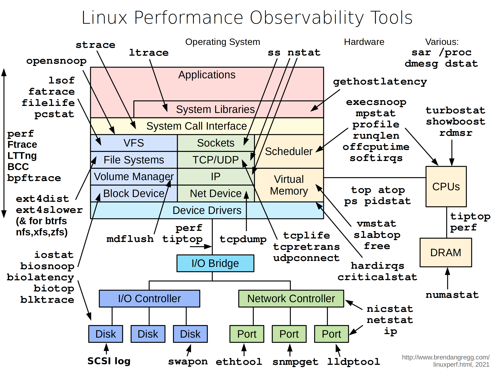

# 性能分析的若干linux命令

## 排查机器负载

~~~~
$ uptime 
23:51:26 up 21:31, 1 user, load average: 30.02, 26.43, 19.02
~~~~

平均负载是指单位时间内，系统处于可运行状态和不可中断状态的平均进程数，也就是平均活跃进程数。
这是一种用来快速查看系统平均负载的方法，它表明了系统中有多少要运行的任务（进程）。在 Linux 系统中，这些数字包含了需要在 CPU 中运行的进程以及正在等待 I/O（通常是磁盘 I/O）的进程。
不可中断状态的进程则是正处于内核态关键流程中的进程，并且这些流程是不可打断的，比如最常见的是等待硬件设备的 I/O 响应，也就是我们在 ps 命令中看到的 D 状态（Uninterruptible Sleep，也称为 Disk Sleep）的进程。比如进程在准备向磁盘写入数据的时候，在得到磁盘的回复前是不能被中断的，否则会造成数据不一致。

这三个数字展示的是一分钟、五分钟和十五分钟内系统的负载总量平均值按照指数比例压缩得到的结果。  
所以一般负载多少合理？ 一般情况下，平均负载需要低于CPU数。

### 负载排查

机器负载高，最可能的原因有2个：
- 计算密集型的情况，大量占用cpu，cpu利用率高，同时负载高。
- IO密集型的情况，等待 I/O 也会导致平均负载升高，但 CPU 使用率不一定高。

一般用mpstat和vmstat可以区分排查。

#### mpstat -P ALL 1
~~~
$ mpstat -P ALL 1
Linux 3.13.0-49-generic (titanclusters-xxxxx)  07/14/2015  _x86_64_ (32 CPU)

07:38:49 PM  CPU   %usr  %nice   %sys %iowait   %irq  %soft  %steal  %guest  %gnice  %idle
07:38:50 PM  all  98.47   0.00   0.75    0.00   0.00   0.00    0.00    0.00    0.00   0.78
07:38:50 PM    0  96.04   0.00   2.97    0.00   0.00   0.00    0.00    0.00    0.00   0.99
07:38:50 PM    1  97.00   0.00   1.00    0.00   0.00   0.00    0.00    0.00    0.00   2.00
07:38:50 PM    2  98.00   0.00   1.00    0.00   0.00   0.00    0.00    0.00    0.00   1.00
07:38:50 PM    3  96.97   0.00   0.00    0.00   0.00   0.00    0.00    0.00    0.00   3.03
[...]
~~~

这个命令打印每个 CPU 核心的时间花费情况，可以用来检查是否有不均衡的情况。一个高使用率的 CPU，可能是某个单线程应用导致的。

#### vmstat 1
~~~~
$ vmstat 1
procs ---------memory---------- ---swap-- -----io---- -system-- ------cpu-----
r  b swpd   free   buff  cache   si   so    bi    bo   in   cs us sy id wa st
34  0    0 200889792  73708 591828    0    0     0     5    6   10 96  1  3  0  0
32  0    0 200889920  73708 591860    0    0     0   592 13284 4282 98  1  1  0  0
32  0    0 200890112  73708 591860    0    0     0     0 9501 2154 99  1  0  0  0
32  0    0 200889568  73712 591856    0    0     0    48 11900 2459 99  0  0  0  0
32  0    0 200890208  73712 591860    0    0     0     0 15898 4840 98  1  1  0  0
~~~~

vmstat(8) 是 virtual memory stat 的缩写，是一种常用工具（几十年前首次为 BSD 创建）。它在每一行打印关键服务器统计信息的摘要。  
vmstat的运行参数为1，每秒打印一次，统计最近一秒钟的情况，不过请忽略第一行，第一行统计的不是前一秒的情况，是统计的OS启动以来的平均值，对于我们排查问题而言，没啥帮助。

需要重点查看的列  
- r：正在运行或等待运行的进程总数。相比 uptime 中的平均负载数据，这个 r 的值不包含 I/O，可以更好的体现 CPU 的饱和情况。如果这个值大于 CPU 的核数，就表示过于饱和了。
- free：使用 KB 单位统计的空闲内存。如果你发现这里是一长串数字，说明你还有很多内存可用 :) 后面我们会介绍 free -m 命令，可以更好的解释空闲内存的情况。
- si,so：Swap换入换出的量。如果这些值非0，说明你内存不够用喽。
- us,sy,id,wa,st：这些是CPU分解值，是针对所有CPU的一个平均值，并非针对某个核心的。us是user time，sy是system time(kernel)，id是idle，wa是wait I/O，st是stolen time（虚拟机才需要关注st）
- in,cs：中断次数，上下文切换次数。通过这两列可以排查**上下文切换过多**的问题。

把用户态时间和内核态时间相加，可以得知CPU是否繁忙。一个恒定水平的wa值表示I/O方面有性能瓶颈。如果wa很高，idle就会很高，因为CPU一直在等待I/O获取数据，没有办法继续运算。  
系统时间system time对于I/O处理是必要的。一个高的系统时间平均值，比如超过20%，可以进一步探查，也许内核处理I/O的效率很低。  
上面的例子中，CPU时间主要花在 user 上面，说明是用户态的应用程序在占用 CPU 时间。CPU 的平均利用率也远远超过了 90%。但这不一定是个问题，通过 r 列的值来检查饱和程度。

## 查看系统日志

dmesg | tail
~~~~
$ dmesg | tail
[1880957.563150] perl invoked oom-killer: gfp_mask=0x280da, order=0, oom_score_adj=0
[...]
[1880957.563400] Out of memory: Kill process 18694 (perl) score 246 or sacrifice child
[1880957.563408] Killed process 18694 (perl) total-vm:1972392kB, anon-rss:1953348kB, file-rss:0kB
[2320864.954447] TCP: Possible SYN flooding on port 7001. Dropping request.  Check SNMP counters.
~~~~

如果系统中存在系统消息，则这条命令会显示了最近的 10 条。从这些消息中找一下有没有Errors，这些Error或许可以帮你定位系统性能问题。上面的例子包含了 oom-killer，以及 TCP 丢弃一个请求。

查看服务崩溃能用`/var/log/syslog`（或`journalctl -b`）进一步排查。

## CPU使用率排查

### CPU使用率查看

Linux启动后，会一直记录CPU的各种信息（/proc/stat）。
~~~~
$ cat /proc/stat
cpu  54868393 389398 20906483 4829334345 4543329 0 1564183 0 0 0
cpu0 6710403 6160 2571211 604546777 85372 0 284854 0 0 0
cpu1 6592902 5056 2554600 604807662 50615 0 192645 0 0 0
~~~~

这里时间单位是CPU节拍，不同的系统，一个CPU节拍对应的实际时间也不一样。

`CPU历史总使用率 = 1 - 空间时间(idle time，第五列)/总CPU时间（一般前8列相加）`

#### pidstat 

能看到进程的用户态CPU使用率和内核态CPU使用率等信息。
~~~~
$ pidstat 1
Linux 3.13.0-49-generic (titanclusters-xxxxx)  07/14/2015    _x86_64_    (32 CPU)

07:41:02 PM   UID       PID    %usr %system  %guest    %CPU   CPU  Command
07:41:03 PM     0         9    0.00    0.94    0.00    0.94     1  rcuos/0
07:41:03 PM     0      4214    5.66    5.66    0.00   11.32    15  mesos-slave
07:41:03 PM     0      4354    0.94    0.94    0.00    1.89     8  java
07:41:03 PM     0      6521 1596.23    1.89    0.00 1598.11    27  java
07:41:03 PM     0      6564 1571.70    7.55    0.00 1579.25    28  java
07:41:03 PM 60004     60154    0.94    4.72    0.00    5.66     9  pidstat

07:41:03 PM   UID       PID    %usr %system  %guest    %CPU   CPU  Command
07:41:04 PM     0      4214    6.00    2.00    0.00    8.00    15  mesos-slave
07:41:04 PM     0      6521 1590.00    1.00    0.00 1591.00    27  java
07:41:04 PM     0      6564 1573.00   10.00    0.00 1583.00    28  java
07:41:04 PM   108      6718    1.00    0.00    0.00    1.00     0  snmp-pass
07:41:04 PM 60004     60154    1.00    4.00    0.00    5.00     9  pidstat
~~~~

pidstat 有点像 top 针对特定进程的统计视图，与 top 不同的是，pidstat 会滚动打印，而不是清除屏幕。这对于观察一段时间内的模式很有用，也可以把你看到的东西（复制-粘贴）记录到你的调查记录中。  
上面的例子确定了两个负责消耗CPU的java进程。%CPU一栏是所有CPU的总和；1591%显示这个java进程几乎消耗了16个CPU。

### CPU使用率排查

perf命令，通过perf stat、perf report可以查C++，php， java 等语言编写的程序的性能。

- 监控正在运行的程序`perf record -p <进程id> -g -o perf.data`。
- `perf report -i perf.data`会打开一个交互式界面，其中按照热点消耗告警的次数，从高到低列出了使用 CPU 时间最多的函数。

使用Flame Graph(https://github.com/brendangregg/FlameGraph )可以生成火焰图。

## 磁盘IO

iostat -xz 1
~~~~
$ iostat -xz 1
Linux 3.13.0-49-generic (titanclusters-xxxxx)  07/14/2015  _x86_64_ (32 CPU)

avg-cpu:  %user   %nice %system %iowait  %steal   %idle
73.96    0.00    3.73    0.03    0.06   22.21

Device:   rrqm/s   wrqm/s     r/s     w/s    rkB/s    wkB/s avgrq-sz avgqu-sz   await r_await w_await  svctm  %util
xvda        0.00     0.23    0.21    0.18     4.52     2.08    34.37     0.00    9.98   13.80    5.42   2.44   0.09
xvdb        0.01     0.00    1.02    8.94   127.97   598.53   145.79     0.00    0.43    1.78    0.28   0.25   0.25
xvdc        0.01     0.00    1.02    8.86   127.79   595.94   146.50     0.00    0.45    1.82    0.30   0.27   0.26
dm-0        0.00     0.00    0.69    2.32    10.47    31.69    28.01     0.01    3.23    0.71    3.98   0.13   0.04
dm-1        0.00     0.00    0.00    0.94     0.01     3.78     8.00     0.33  345.84    0.04  346.81   0.01   0.00
dm-2        0.00     0.00    0.09    0.07     1.35     0.36    22.50     0.00    2.55    0.23    5.62   1.78   0.03
[...]
~~~~

这是了解块状设备（磁盘）的一个很好的工具，包括应用的工作负载和由此产生的性能指标。
- r/s, w/s, rkB/s, wkB/s：这些是设备的每秒读次数、写次数、读KB和写KB。使用这些来描述工作负载。一个性能问题可能仅仅是由于过分的负载。
- await：I/O的平均时间，以毫秒计。这是应用的I/O请求所耗费的时间，它包括排队的时间和被服务的时间。大于预期的平均时间可能是设备饱和的指标，或设备问题。
- avgqu-sz: 发给设备的平均请求数。大于1的值可能是饱和的证据（尽管设备通常可以并行处理请求，特别是在多个后端磁盘前的虚拟设备）。
- %util：设备利用率。这实际上是一个繁忙的百分比，显示设备每秒钟进行工作的时间。大于60%的值通常会导致性能不佳（应该在等待中看到），尽管这取决于设备的情况。接近100%的值通常表示饱和。

如果存储设备是一个逻辑磁盘设备，面向许多后端磁盘，那么100%的利用率可能只是意味着一些I/O在100%的时间内被处理，然而，后端磁盘可能远远没有饱和，可能能够处理更多的工作。  
请记住，磁盘I/O性能差并不一定是应用程序的问题。许多技术通常用于异步执行I/O，这样应用程序就不会阻塞并直接受到延迟的影响（例如，读取时的超前读取和写入时的缓冲）。

## 后续分析

还有更多的命令和方法，你可以应用这些命令和方法来深入研究。  
请看Brendan Gregg大佬在[linux Performance](https://www.brendangregg.com/linuxperf.html)分享的命令，涵盖了可观察性、基准测试、调优、静态性能调优、剖析和跟踪。

